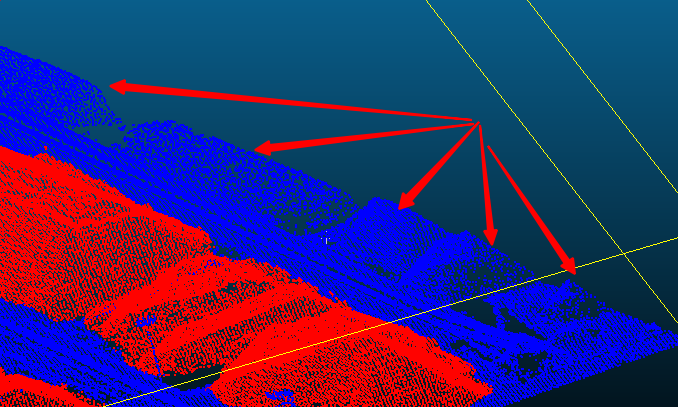

# LabeledDataset
存放整理好的标注数据，按照数据类型-目的组织


## LabeledYard/Labeled

该目录存放整理好的堆料标注数据（目前有9个pcd文件），主要用于堆料的语义分割（依据 `label` 标签）与实例分割（依据 `object` 标签）。

### 数据类型

- 文件格式：`.pcd`
- 内容示例：

```
VERSION .7
FIELDS x y z label object
SIZE 4 4 4 4 4
TYPE F F F I I
COUNT 1 1 1 1 1
WIDTH 332799
HEIGHT 1
POINTS 332799
VIEWPOINT 0 0 0 1 0 0 0
DATA ascii
536.25806 149.89262 11.471937 1 58
```

### 格式内容解析

1. **VERSION .7**
 - **版本号**，表示PCD文件的版本，这里是`0.7`版。

2. **FIELDS x y z label object**
 - **字段定义**，文件中存储的字段包括：
   - `x`、`y`、`z`：点的三维坐标
   - `label` 和 `object`：附加的整数类型字段，可能用于分类或标识点云中的对象。

3. **SIZE 4 4 4 4 4**
 - **数据大小**，每个字段的数据大小(以字节为单位)。这里 `x`、`y`、`z`、`label`、`object` 每个字段都是 `4` 字节。

4. **TYPE F F F I I**
 - **数据类型**，每个字段的数据类型：
   - `F` 表示浮点数(`float`)
   - `I` 表示整数(`integer`)

5. **COUNT 1 1 1 1 1**
 - **元素数量**，每个字段的元素数量，通常是 `1`，表示每个字段有一个元素。

6. **WIDTH 332799**
 - **宽度**，表示点云的宽度。这里表示总共有 `332799` 个点。

7. **HEIGHT 1**
 - **高度**，对于非组织化的点云，值通常为 `1`。表示点云是平面的，没有行列结构。

8. **POINTS 332799**
 - **总点数**，与宽度相同，表示点云的总点数是 `332799`。

9. **VIEWPOINT 0 0 0 1 0 0 0**
 - **视点**，点云的视点（相机位置和方向）。格式为 `x y z qw qx qy qz`。这里表示的是默认视点。

10. **DATA ascii**
  - **存储格式**，数据的存储格式，这里是 `ASCII` 格式。

### 数据行解析

每行数据对应一个点的详细信息。以下是示例数据行的含义：
536.25806 149.89262 11.471937 1 58

- `536.25806`：`x` 坐标
- `149.89262`：`y` 坐标
- `11.471937`：`z` 坐标
- `1`：`label` 值 (整数)
- `58`：`object` 值 (整数)

### 点云数据描述

这段 `.pcd` 文件描述了一个包含 `332799` 个点的点云数据，其中每个点有以下属性：
- **三维坐标**：`x`、`y`、`z`
- **标签**：`label` (用于语义分割)
  - `1`：表示堆料部分
  - `0`：表示非堆料部分
- **对象标识**：`object` (用于实例分割)

文件使用 `ASCII` 格式存储数据。

### 数据目的

该数据集主要用于堆料的语义分割和实例分割任务：
- **语义分割**：根据 `label` 标签对堆料进行分类：
  - `1` 表示堆料
  - `0` 表示非堆料
- **实例分割**：根据 `object` 标签识别不同的实例对象。
  - `-1` 表示非堆料部分
  - `0` 及以上的不同值对应不同的堆料实例


## LabeledYard/ProcessedLabeled （待继续完善）

该目录包含经过处理和标注的堆料场景数据（目前有5个 `.pcd` 文件），主要用于堆料场景的语义分割和实例分割任务。与 `LabeledYard/Labeled` 中的数据类似，但这些数据经过了进一步的处理和标注。

### 数据类型

- 文件格式：`.pcd`
- 内容示例：

```
VERSION .7
FIELDS x y z label object
SIZE 4 4 4 4 4
TYPE F F F I I
COUNT 1 1 1 1 1
WIDTH 390033
HEIGHT 1
POINTS 390033
VIEWPOINT 0 0 0 1 0 0 0
DATA ascii
250.380780 596.280760 15.215565 1 27
```


### 格式内容解析

1. **VERSION .7**
 - **版本号**，表示 PCD 文件的版本，这里是 `0.7` 版。

2. **FIELDS x y z label object**
 - **字段定义**，文件中存储的字段包括：
   - `x`、`y`、`z`：点的三维坐标
   - `label` 和 `object`：附加的整数类型字段，可能用于分类或标识点云中的对象。

3. **SIZE 4 4 4 4 4**
 - **数据大小**，每个字段的数据大小（以字节为单位）。这里 `x`、`y`、`z`、`label`、`object` 每个字段都是 `4` 字节。

4. **TYPE F F F I I**
 - **数据类型**，每个字段的数据类型：
   - `F` 表示浮点数(`float`)
   - `I` 表示整数(`integer`)

5. **COUNT 1 1 1 1 1**
 - **元素数量**，每个字段的元素数量，通常是 `1`，表示每个字段有一个元素。

6. **WIDTH 390033**
 - **宽度**，表示点云的宽度。这里表示总共有 `390033` 个点。

7. **HEIGHT 1**
 - **高度**，对于非组织化的点云，值通常为 `1`，表示点云是平面的，没有行列结构。

8. **POINTS 390033**
 - **总点数**，与宽度相同，表示点云的总点数是 `390033`。

9. **VIEWPOINT 0 0 0 1 0 0 0**
 - **视点**，点云的视点（相机位置和方向）。格式为 `x y z qw qx qy qz`。这里表示的是默认视点。

10. **DATA ascii**
 - **存储格式**，数据的存储格式，这里是 `ASCII` 格式。

### 数据行解析

每行数据对应一个点的详细信息。以下是示例数据行的含义：

250.380780 596.280760 15.215565 1 27


- `250.380780`：`x` 坐标
- `596.280760`：`y` 坐标
- `15.215565`：`z` 坐标
- `1`：`label` 值 (整数)
- `27`：`object` 值 (整数)

### 点云数据描述

这段 `.pcd` 文件描述了一个包含 `390033` 个点的点云数据，其中每个点有以下属性：
- **三维坐标**：`x`、`y`、`z`
- **标签**：`label` (用于语义分割)
  - `1`：表示堆料部分
  - `0`：表示非堆料部分
- **对象标识**：`object` (用于实例分割)
  - 数据中 `object` 值经过 DBSCAN 聚类算法的辅助标注。对于原本没有标注好的 `object`，已经进行了自动化标注。但由于算法的局限性，仍可能存在少数部分距离较近但不同的堆料 `object` 值被聚类为同一值的情况，这部分数据需要进一步补充标注。

### 数据目的

该数据集主要用于堆料场景的语义分割和实例分割任务：
- **语义分割**：根据 `label` 标签对堆料进行分类：
  - `1` 表示堆料
  - `0` 表示非堆料
- **实例分割**：根据 `object` 标签识别不同的实例对象，进行了 DBSCAN 聚类辅助标注，仍需对少数没区分开的标注的区域进行人工补充标注。


## PanMeiYi （待扩充数据量）

这个目录包含与盘煤仪相关的数据集和文件（目前有20个ply文件），主要用于盘煤仪项目的去大臂数据训练。

### 数据类型

- 文件格式：`.ply`
- 内容示例：

```
ply
format binary_little_endian 1.0
element vertex 165158
property float x
property float y
property float z
property uchar red
property uchar green
property uchar blue
end_header
```

### 格式内容解析

1. **ply**
 - 文件格式声明。这里使用的是 `PLY` 格式，常用于存储三维点云数据。

2. **format binary_little_endian 1.0**
 - **存储格式**，文件使用 `binary_little_endian` 格式，这是一种二进制小端字节序，版本为 `1.0`。

3. **element vertex 165158**
 - **顶点元素**，声明文件中包含 `165158` 个顶点，每个顶点对应一个点云数据点。

4. **property float x**
 **property float y**
 **property float z**
 - **三维坐标**，每个顶点包含 `x`、`y`、`z` 三个坐标值，均为浮点数类型(`float`)。

5. **property uchar red**
 **property uchar green**
 **property uchar blue**
 - **颜色属性**，每个顶点包含 `red`、`green`、`blue` 三个颜色通道，分别表示该点在 RGB 颜色空间中的值，类型为无符号字符(`uchar`)。

6. **end_header**
 - **结束标识**，表示文件头部定义结束，接下来是实际的点云数据。

### 数据行解析

在 `PLY` 文件中，每个点的数据包括三维坐标和颜色信息。以下是颜色属性的具体含义：

- **颜色标签**：`red`、`green`、`blue` 三个颜色通道用于标识点的类别。
- `0 255 0` (绿色)：表示煤堆。
- `255 0 0` (红色)：表示大臂。

目前数据集主要包含红色和绿色两类点，分别用于区分煤堆和大臂，这些信息对于去除大臂的训练任务至关重要。


### 数据目的

该数据集主要用于盘煤仪项目中的大臂去除任务，通过对点云数据中的红色（大臂）部分进行分割，实现煤堆的精准识别和分析。具体来说：

- **大臂分割**：依据颜色标签中的 `red`、`green`、`blue` 通道，将点云中的大臂（红色）与煤堆（绿色）区分开来。


## dongjiakou

该目录包含董家口船舱部分的点云数据（目前有10个pcd文件），包括船舱内的堆料、部分船体，以及可能存在的抓斗和飞点数据。主要用于船舱堆料与非堆料的区分。

### 数据类型

- 文件格式：`.pcd`
- 内容示例：

```
VERSION .7
FIELDS x y z label object
SIZE 4 4 4 4 4
TYPE F F F I I
COUNT 1 1 1 1 1
WIDTH 4933
HEIGHT 1
POINTS 4933
VIEWPOINT 0 0 0 1 0 0 0
DATA ascii
73.19999694824219 83 -6.585000038146973 1 -1
```


### 格式内容解析

1. **VERSION .7**
 - **版本号**，表示PCD文件的版本，这里是 `0.7` 版。

2. **FIELDS x y z label object**
 - **字段定义**，文件中存储的字段包括：
   - `x`、`y`、`z`：点的三维坐标
   - `label`：堆料标签，主要用于区分堆料和其他部分
   - `object`：对象标识，在此数据集中统一设置为 `-1`，表示无标注。

3. **SIZE 4 4 4 4 4**
 - **数据大小**，每个字段的数据大小（以字节为单位）。`x`、`y`、`z`、`label`、`object` 每个字段都是 `4` 字节。

4. **TYPE F F F I I**
 - **数据类型**，每个字段的数据类型：
   - `F` 表示浮点数(`float`)
   - `I` 表示整数(`integer`)

5. **COUNT 1 1 1 1 1**
 - **元素数量**，每个字段的元素数量，通常是 `1`，表示每个字段有一个元素。

6. **WIDTH 4933**
 - **宽度**，表示点云的宽度。这里表示总共有 `4933` 个点。

7. **HEIGHT 1**
 - **高度**，对于非组织化的点云，值通常为 `1`，表示点云是平面的，没有行列结构。

8. **POINTS 4933**
 - **总点数**，与宽度相同，表示点云的总点数是 `4933`。

9. **VIEWPOINT 0 0 0 1 0 0 0**
 - **视点**，点云的视点（相机位置和方向）。格式为 `x y z qw qx qy qz`。这里表示的是默认视点。

10. **DATA ascii**
  - **存储格式**，数据的存储格式，这里是 `ASCII` 格式。

### 数据行解析

在此 `PCD` 文件中，每个点的数据包括三维坐标和标签信息。以下是 `label` 和 `object` 字段的具体说明：

- **label 标签**：
- `0`：表示堆料。
- `1`：表示船体、可能存在的抓斗和飞点等非堆料部分。

- **object 标识**：
- 目前统一设置为 `-1`，表示无标注。


### 数据目的

该数据集主要用于区分船舱内的堆料和非堆料部分。具体来说：

- **堆料与非堆料区分**：根据 `label` 标签的值，可以将点云数据分为堆料区域（`label = 0`）和其他部分（`label = 1`）。

数据中可能存在抓斗和飞点，但并非一定存在，该数据集暂时没有明确的使用用途，可以用于船舱堆料与非堆料的区分训练。


## pc_grapple

该目录包含舱内的点云数据（目前存在12个pcd文件），主要用于区分船舱内的堆料与非堆料部分。数据涵盖了堆料、抓斗、绳索和飞点等信息。

### 数据类型

- 文件格式：`.pcd`
- 内容示例：

```
VERSION .7
FIELDS x y z label object
SIZE 4 4 4 4 4
TYPE F F F I I
COUNT 1 1 1 1 1
WIDTH 23326
HEIGHT 1
POINTS 23326
VIEWPOINT 0 0 0 1 0 0 0
DATA ascii
111.4000015258789 88.5 -15.944999694824219 0 -1
```

### 格式内容解析

1. **VERSION .7**
 - **版本号**，表示PCD文件的版本，这里是 `0.7` 版。

2. **FIELDS x y z label object**
 - **字段定义**，文件中存储的字段包括：
   - `x`、`y`、`z`：点的三维坐标。
   - `label`：标签值，用于区分不同的对象类型。
   - `object`：对象标识，在此数据集中统一设置为 `-1`，表示无标注。

3. **SIZE 4 4 4 4 4**
 - **数据大小**，每个字段的数据大小（以字节为单位）。`x`、`y`、`z`、`label`、`object` 每个字段都是 `4` 字节。

4. **TYPE F F F I I**
 - **数据类型**，每个字段的数据类型：
   - `F` 表示浮点数(`float`)。
   - `I` 表示整数(`integer`)。

5. **COUNT 1 1 1 1 1**
 - **元素数量**，每个字段的元素数量，通常是 `1`，表示每个字段有一个元素。

6. **WIDTH 23326**
 - **宽度**，表示点云的宽度。这里表示总共有 `23326` 个点。

7. **HEIGHT 1**
 - **高度**，对于非组织化的点云，值通常为 `1`，表示点云是平面的，没有行列结构。

8. **POINTS 23326**
 - **总点数**，与宽度相同，表示点云的总点数是 `23326`。

9. **VIEWPOINT 0 0 0 1 0 0 0**
 - **视点**，点云的视点（相机位置和方向）。格式为 `x y z qw qx qy qz`。这里表示的是默认视点。

10. **DATA ascii**
  - **存储格式**，数据的存储格式，这里是 `ASCII` 格式。

### 数据行解析

在此 `PCD` 文件中，每个点的数据包括三维坐标和标签信息。以下是 `label` 和 `object` 字段的具体说明：

- **label 标签**：
- `0`：表示船舱内的堆料。
- `1`：表示船舱内的抓斗。
- `2`：表示绳索。
- `3`：表示飞点。

- **object 标识**：
- 目前统一设置为 `-1`，表示无标注。

### 数据目的

该数据集主要用于区分船舱内的堆料和非堆料部分。具体来说：

- **堆料与非堆料区分**：根据 `label` 标签的值，可以将点云数据分为以下几类：
- 堆料区域（`label = 0`）
- 抓斗（`label = 1`）
- 绳索（`label = 2`）
- 飞点（`label = 3`）

这些信息用于分析和处理船舱内的不同对象类型。主要关注点是区分堆料和非堆料部分。


## pianzai

此目录包含偏载项目的数据（目前存在19个pcd文件），主要用于车厢和蒸汽的分离分析。数据涵盖了车厢和蒸汽的点云信息。

### 数据类型

- 文件格式：`.pcd`
- 内容示例：

```
VERSION .7
FIELDS x y z label object
SIZE 4 4 4 4 4
TYPE F F F I I
COUNT 1 1 1 1 1
WIDTH 269584
HEIGHT 1
POINTS 269584
VIEWPOINT 0 0 0 1 0 0 0
DATA ascii
2577.51953125 -1.532938003540039 2.8952159881591797 0 -1
```


### 格式内容解析

1. **VERSION .7**
 - **版本号**，表示PCD文件的版本，这里是 `0.7` 版。

2. **FIELDS x y z label object**
 - **字段定义**，文件中存储的字段包括：
   - `x`、`y`、`z`：点的三维坐标。
   - `label`：标签值，用于区分不同的对象类型。
   - `object`：对象标识，在此数据集中统一设置为 `-1`，表示无标注。

3. **SIZE 4 4 4 4 4**
 - **数据大小**，每个字段的数据大小（以字节为单位）。`x`、`y`、`z`、`label`、`object` 每个字段都是 `4` 字节。

4. **TYPE F F F I I**
 - **数据类型**，每个字段的数据类型：
   - `F` 表示浮点数(`float`)。
   - `I` 表示整数(`integer`)。

5. **COUNT 1 1 1 1 1**
 - **元素数量**，每个字段的元素数量，通常是 `1`，表示每个字段有一个元素。

6. **WIDTH 269584**
 - **宽度**，表示点云的宽度。这里表示总共有 `269584` 个点。

7. **HEIGHT 1**
 - **高度**，对于非组织化的点云，值通常为 `1`，表示点云是平面的，没有行列结构。

8. **POINTS 269584**
 - **总点数**，与宽度相同，表示点云的总点数是 `269584`。

9. **VIEWPOINT 0 0 0 1 0 0 0**
 - **视点**，点云的视点（相机位置和方向）。格式为 `x y z qw qx qy qz`。这里表示的是默认视点。

10. **DATA ascii**
  - **存储格式**，数据的存储格式，这里是 `ASCII` 格式。

### 数据行解析

在此 `PCD` 文件中，每个点的数据包括三维坐标和标签信息。以下是 `label` 和 `object` 字段的具体说明：

- **label 标签**：
- `0`：表示车厢部分。
- `1`：表示蒸汽部分。

- **object 标识**：
- 统一设置为 `-1`，表示无标注。

### 数据目的

该数据集主要用于车厢和蒸汽的分离分析。具体来说：

- **车厢与蒸汽的区分**：根据 `label` 标签的值，可以将点云数据分为以下几类：
- 车厢部分（`label = 0`）
- 蒸汽部分（`label = 1`）

这些信息对应车厢负载和蒸汽的点云数据情况，主要关注点是区分车厢和蒸汽部分。


## relabel_coal_pile

该目录包含重新标注的煤堆数据（目前存在4个pcd文件），主要用于堆料的语义分割任务。数据中 `label` 和 `object` 字段的设置用于区分堆料与非堆料部分，暂时仅适合作为堆料的语义分割。

### 数据类型

- 文件格式：`.pcd`
- 内容示例：

```
VERSION .7
FIELDS x y z label object
SIZE 4 4 4 4 4
TYPE F F F I I
COUNT 1 1 1 1 1
WIDTH 398528
HEIGHT 1
POINTS 398528
VIEWPOINT 0 0 0 1 0 0 0
DATA ascii
402.52164 568.70721 4.2745104 0 -1
```


### 格式内容解析

1. **VERSION .7**
 - **版本号**，表示 PCD 文件的版本，这里是 `0.7` 版。

2. **FIELDS x y z label object**
 - **字段定义**，文件中存储的字段包括：
   - `x`、`y`、`z`：点的三维坐标
   - `label` 和 `object`：附加的整数类型字段，可能用于分类或标识点云中的对象。

3. **SIZE 4 4 4 4 4**
 - **数据大小**，每个字段的数据大小（以字节为单位）。这里 `x`、`y`、`z`、`label`、`object` 每个字段都是 `4` 字节。

4. **TYPE F F F I I**
 - **数据类型**，每个字段的数据类型：
   - `F` 表示浮点数(`float`)
   - `I` 表示整数(`integer`)

5. **COUNT 1 1 1 1 1**
 - **元素数量**，每个字段的元素数量，通常是 `1`，表示每个字段有一个元素。

6. **WIDTH 398528**
 - **宽度**，表示点云的宽度。这里表示总共有 `398528` 个点。

7. **HEIGHT 1**
 - **高度**，对于非组织化的点云，值通常为 `1`，表示点云是平面的，没有行列结构。

8. **POINTS 398528**
 - **总点数**，与宽度相同，表示点云的总点数是 `398528`。

9. **VIEWPOINT 0 0 0 1 0 0 0**
 - **视点**，点云的视点（相机位置和方向）。格式为 `x y z qw qx qy qz`。这里表示的是默认视点。

10. **DATA ascii**
 - **存储格式**，数据的存储格式，这里是 `ASCII` 格式。

### 数据行解析

每行数据对应一个点的详细信息。以下是示例数据行的含义：

402.52164 568.70721 4.2745104 0 -1


- `402.52164`：`x` 坐标
- `568.70721`：`y` 坐标
- `4.2745104`：`z` 坐标
- `0`：`label` 值 (整数)
- `-1`：`object` 值 (整数)

### 点云数据描述

这段 `.pcd` 文件描述了一个包含 `398528` 个点的点云数据，其中每个点有以下属性：
- **三维坐标**：`x`、`y`、`z`
- **标签**：`label` (用于语义分割)
  - `1`：表示堆料部分
  - `0`：表示非堆料部分
- **对象标识**：`object` (用于实例分割)
  - 统一为 `-1`，表示无对象标注

### 数据目的

该数据集主要用于堆料的语义分割任务：
- **语义分割**：根据 `label` 标签对堆料进行分类：
  - `1` 表示堆料
  - `0` 表示非堆料

**注意**：部分边缘区域存在漏标情况，因此仍需补充标注工作。目前，该数据集仅适合作为堆料的语义分割使用。




## Modified_Labeled3D/Labeled3D

该目录包含159个 `.las` 文件，这些文件主要用于三维场景的分割，以及后续对提取的堆料进行体积等计算，涵盖堆料、大臂以及其他噪声点云的分类信息。

### 数据类型

- 文件格式：`.las`
- 文件数量：159个

### 数据属性说明

1. **Number Of Returns**
   - **返回次数**，整个场景中所有点的 `Number Of Returns` 值均为 `1`，表示每个点仅有一次激光返回。

2. **Return Number**
   - **返回编号**，整个场景中所有点的 `Return Number` 值均为 `1`，与 `Number Of Returns` 对应。

3. **Classification**
   - **分类属性**，用于标识不同类型的点云数据。主要分类值及其含义如下：
     - `0`：表示堆料部分
     - `15`：表示大臂
     - `6`：表示其他噪声

### 场景描述

- **矩形点云场景**：包含堆料、大臂以及其他噪声类。数据覆盖了整个场景，其中主要关注堆料和大臂的分类，以及排除噪声点。

- **修正内容**：在原始数据中，大臂底部的点云和部分堆料误标为 `Classification` 值为 `2` 的类，经过处理，这些错误标注已被修正。修正后，`Classification` 属性严格按照上述分类标准进行了调整，确保堆料、大臂和噪声类别的准确性。

### 数据目的

该数据集主要用于以下任务：

- **堆料与大臂的区分**：根据 `Classification` 属性中的值，将堆料、大臂和噪声点正确分类。
- **噪声排除**：通过识别 `Classification` 值为 `6` 的点云数据，辅助去除其他噪声点，以提升数据分析和处理的准确性。

修正后的数据用于堆料提取、模型训练和对应堆料的体积等属性计算。
